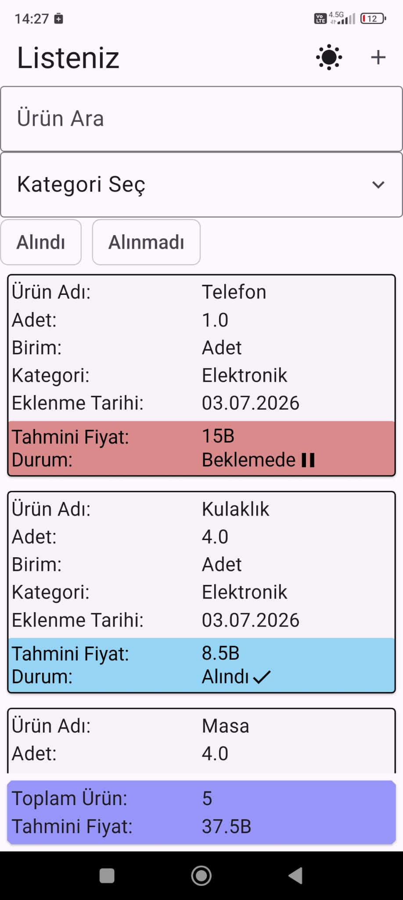
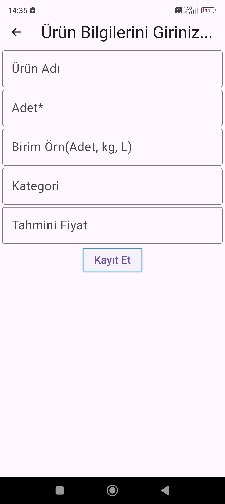
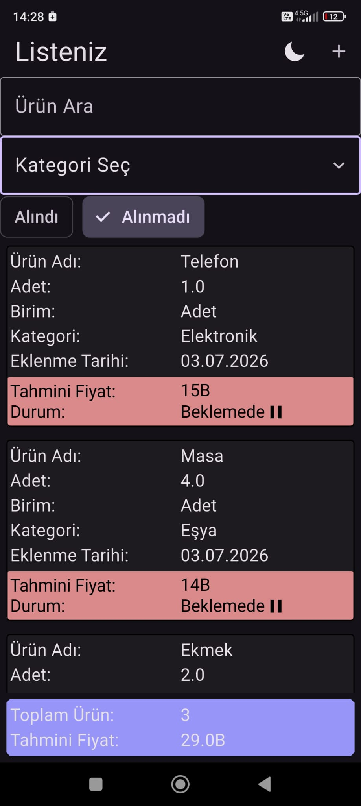
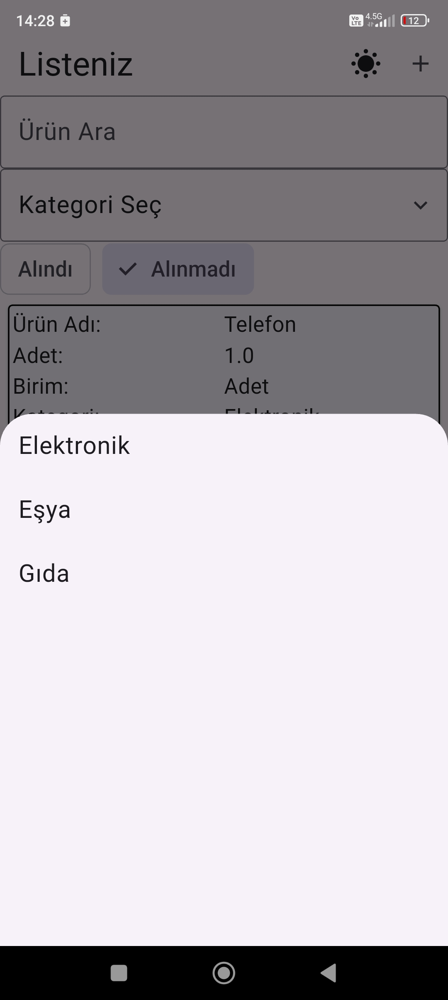
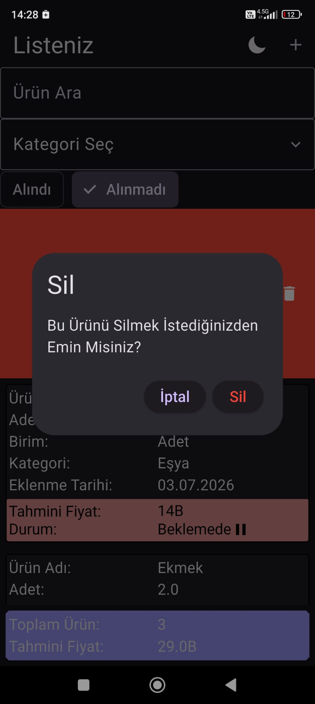

# 🛒 Shopping List App

A new Flutter project.

---

## 🎯 Uygulama Amacı

Alışveriş listenizi tutabileceğiniz bir uygulamadır.  
Ürünlere tahmini fiyat, birim ve adet gibi bilgiler ekleyebilirsiniz.

- Sağdan sola kaydırarak ürün silme
- Soldan sağa kaydırarak düzenleme ekranına gitme

---

## 📌 Uygulama Bilgisi

- Custom Validator kullanımı:
  `shared/widgets/app_text_field` içinde birim input için kullanıldı.
  Pozitif sayı ve veri doğrulama işlemleri yapar.

- Extensions kullanımı:
  Büyük sayıları kısaltmak için kullanıldı  
  Örn: `1000000 → 1M`  
  (`core/utils/number_extensions.dart`)

---

## 🚀 Kurulum

```bash
git clone https://github.com/Cutloyut/Shopping_List_App
cd shopping_list
flutter pub get
flutter run
```

---

## 🏗️ Mimari Bilgiler

- Feature-based mimari kullanıldı
- Proje yapısını görmek için:
  `lib/pathinfo.txt`

---

## 📸 Ekran Görüntüleri

### 🏠 Ana Sayfa


### ➕ Ürün Ekleme


### ✏️ Ürün Düzenleme


### 🌙 Dark Mode


### 🔍 Kategori Filitreleme


### ⚠️ Alert Dialog


---

